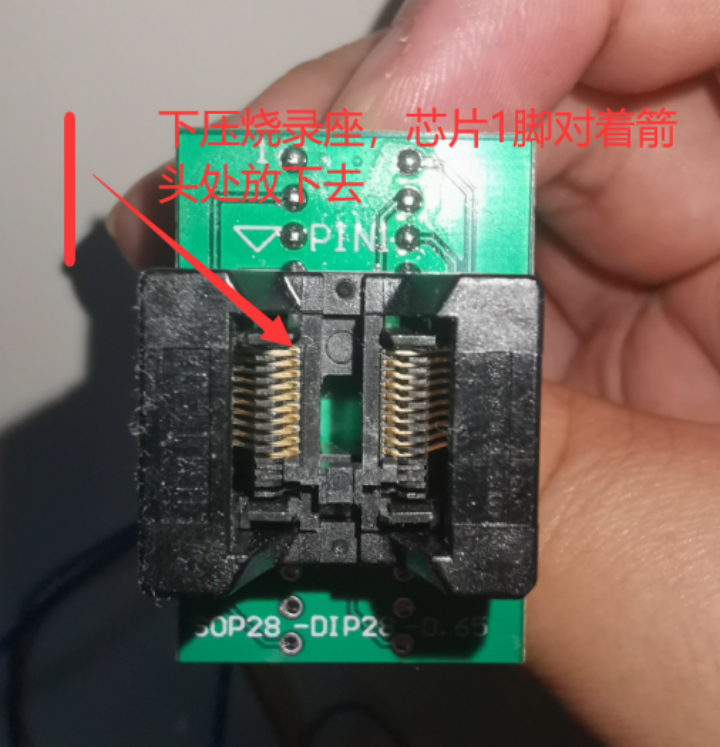
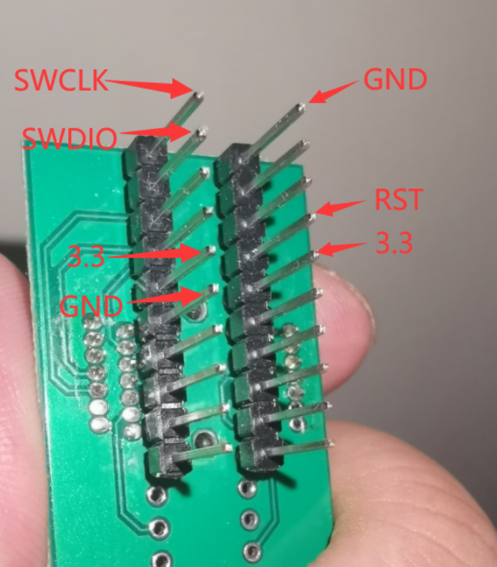

## 3.1 物料型号选择
### 参考小卡的购物车分享

## 3.2 万用表使用
::: warning
待补充
:::
## 3.3 热风枪使用
### 拆手势识别
拆手势识别大约在270度

## 3.4 烧录器的使用
共7条线对应接到烧录器就行。
[购买链接](https://m.tb.cn/h.UHtMKFI https://detail.tmall.com/item.htm?id=598077499819&spm=a1z09.2.0.0.ae8a2e8dJpJYXC&_u=d2bjpssiae1d&skuId=4159919316749)

## 3.5 IIC通讯
::: warning
待补充
:::