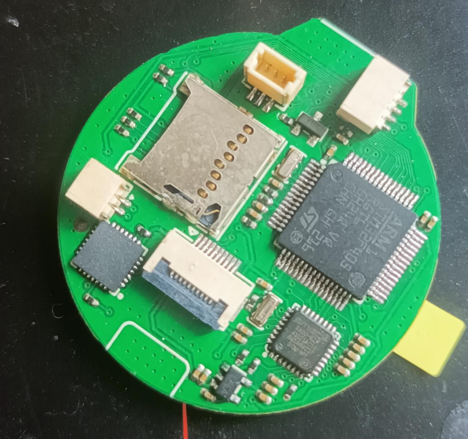
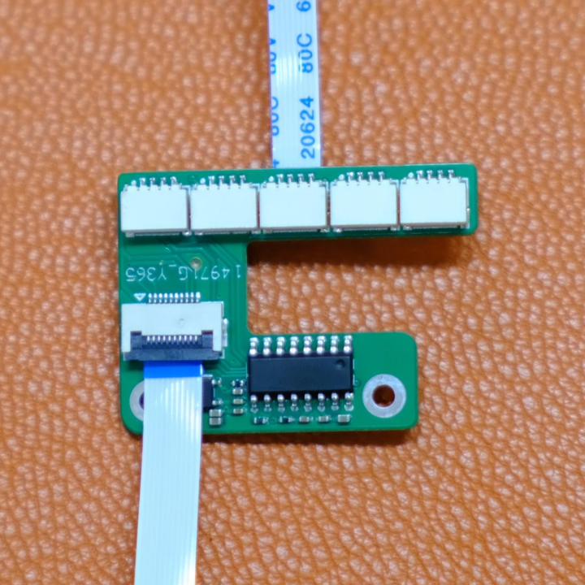
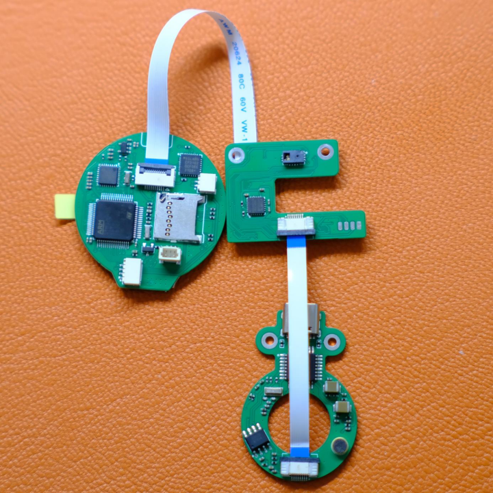
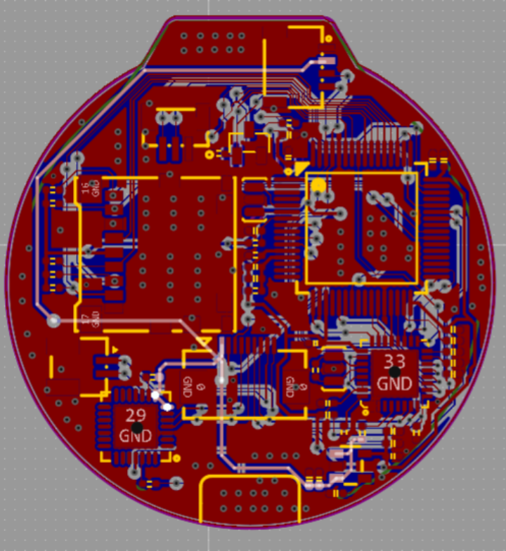
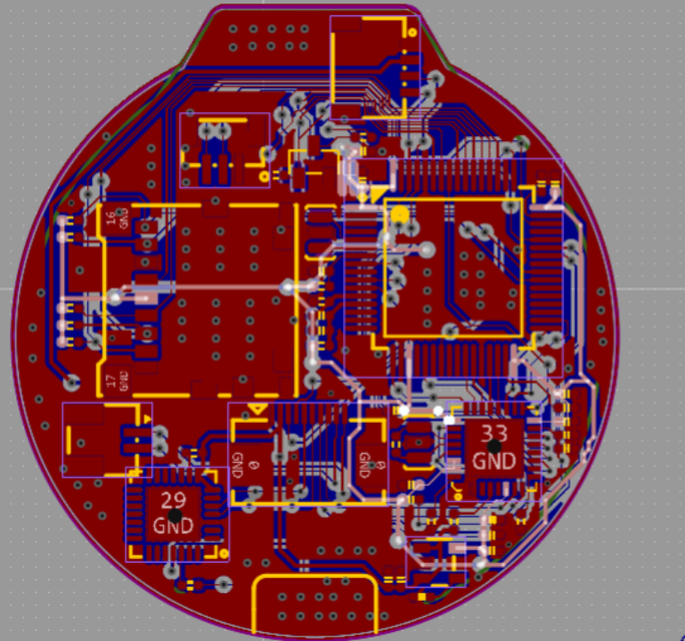
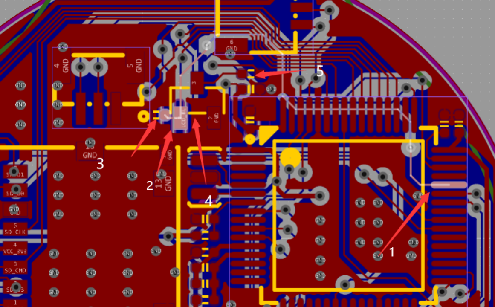

## 4.1 工具准备
### 必备
- [ ] 焊接排风扇或N95（注意呼吸道保护）
- [ ] 电烙铁（最好是可调温的）
- [ ] 热风枪，夹具（最好带灯和放大镜）
- [ ] 锡膏（中温）
- [ ] 吸锡器（吸锡带）
- [ ] 尖头镊子*
- [ ] 热熔胶枪及胶棒（使用时注意，胶滴到皮肤上就是一个水泡）
- [ ] 热缩管（制作推杆挡球，别的内径2mm的塑料管也行）
- [ ] 502胶水
- [ ] 螺丝刀（2mm左右的，螺丝口很细，大螺丝刀没法用）
- [ ] 万用表
- [ ] 烧录器（最好是ST LINK v2减少麻烦）
### 选用
- [ ] 洗板水
- [ ] 可调电源（学生电源）
- [ ] 加热台
- [ ] TSSOP20烧录座（烧录方便，不用在板子上接烧录线）
- [ ] USB显微镜
- [ ] 防割手套（刻刀处理3D打印件还是戴着好，一不小心手上戳个洞）
- [ ] 手钻、2mm钻头 （如果手臂推杆有点卡可以处理下）

## 4.2 材料购买BOM
见群文件。
优先立创商城和淘宝优信，买不到再买别家的。
传感器最好买模块，在把传感器拆下来用。单买传感器可能是坏的。

## 4.3 材料购买白嫖技巧
有白嫖经验的小伙伴请添加白嫖内容

## 4.4 PCB打板及白嫖技巧
[嘉立创打板](https://www.jlc.com/)
不建议直接打稚晖君原版，第二章看完再决定打那个版本的PCB，可以降低复刻难度。
主板的PCB厚度为1.0mm便于安装到头部。
有白嫖经验的小伙伴请添加白嫖内容

## 4.5 模型3D打印
外壳可以是树脂、PLA等，钱多也可以尼龙。内部齿轮推杆等最好用尼龙。 
打印的时候最好与店家沟通，问下材料颜色。 
目前有3个版本： 
稚晖君原版，小鹏原始尺寸修改版、小鹏的PLUS版。稚晖君原版组装起来有点小痛苦，建议打小鹏的改进版本。 
[稚晖君原版（小鹏对文件进行了 整理）](https://gitee.com/txp666/ElectronBot_Study/tree/main/3D%E6%89%93%E5%8D%B0/%E5%8E%9F%E7%89%88) 
[小鹏PLUS版，空间更大组装更方便](https://gitee.com/txp666/ElectronBot_Study/tree/main/3D%E6%89%93%E5%8D%B0/%E4%BF%AE%E6%94%B9-PLUS(%E8%83%96)) 
[小鹏原始尺寸修改版，配合小卡的整套PCB](https://gitee.com/txp666/ElectronBot_Study/tree/main/3D%E6%89%93%E5%8D%B0/%E5%8E%9F%E5%B0%BA%E5%AF%B8%E4%BF%AE%E6%94%B9) 
::: warning
1.  将对应文件夹里的文件全都打一份就行，小鹏把一样多个的模型集成到了一个STEP或STL文件中
2.  STL和STEP文件格式3d打印店都是支持的，自己用3D打印机打得将STEP转成STL
:::
### 4.5.1 3D打印店打印
[立创三维猴](https://www.sanweihou.com/)
::: warning
注：不要提交了模型就不管，根据识别结果需要点一下自己承担打印风险(打印出来没有问题)。
:::
淘宝店：不做推荐 自行搜索关键词 3d打印 

### 4.5.3 自己打印
[STEP转STL](http://www.mohou.com/tools/stlconverter.html)
脖子不要加支撑，有排线孔，别给堵住了。  
FDM打印机： 
清理打磨是个大工程，大件可以自己打着玩，小件建议3D打印店打，自己打失败率高，后期处理也麻烦。 
尼龙打印完需要退火处理，否者每层之间连接不牢固，受力就崩开。笔者使用280度融化的碳纤维尼龙打印的齿轮等部件，热风枪250度吹个3分钟基本完成退火。可以根据自己的打印材料慢慢试。 
光固化打印机： 
有光固化打印机的小伙伴可以补充此小节 

### 4.5.3 fusion 360白嫖技巧
[白嫖使用年限方法参考视频](https://b23.tv/pmjEwIY?share_medium=android&share_source=qq&bbid=XYA5068A4B0C05FD553D70DD068042ED2ABF6&ts=1665681438326) 
[fusion 360下载地址](https://www.autodesk.com.cn/products/fusion-360/personal)

## 4.6 主板
TF卡可以不焊，暂时没用到 
用小卡优化版本可以降低组装难度 
[链接](https://oshwhub.com/taosi/ElectronBotyu-yin-ban) 
语音版主板没搞过音频的小伙伴不建议打，劲森给出了简单的办法且实用性更强。 

主板成品图（绿荫嘉立创贴片）
传感器成品图

USB语音版成品图

小卡PCB链接图

### 4.6.1 焊接建议
1.  焊接FFC座子之前建议 先用传感器板子练练手，如果焊接错误，处理起来很容易把焊盘弄环，从而导致板子废掉。 
2.  屏幕焊接时最好把引脚有塑料那一面的塑料刮掉并上锡 
3.  屏幕焊接好之后，在主板及屏幕测试完成之前，建议使用胶布固定，防止移动过程中导致排线折断或者扯掉焊盘。 
4.  FFC座子用镊子轻轻拨一下不晃就好，不要反复质疑引脚与焊盘是否相连。 
5.  上电前一定要仔细观察，检测短路，并确定锡已经完全蒸发。 

### 4.6.2 电压检测
主板电压检测点位（小卡版主板） 
5V 

3.3V 

### 4.6.3 屏幕
屏幕测试需要用到专门的测试上位机和测试固件，群文件里找一找，稚晖君原版的上位机缺文件

### 4.6.4 屏幕常见问题 
1.  没有微光，也没有花屏 
可能原因：背光电路有问题 
解决方法：检查背光电路 

（1）  检查1和2是否导通 
（2）  3，4，5加焊 
2.  没有花屏
可能原因：屏幕排线虚焊 
解决办法：排线加焊 
