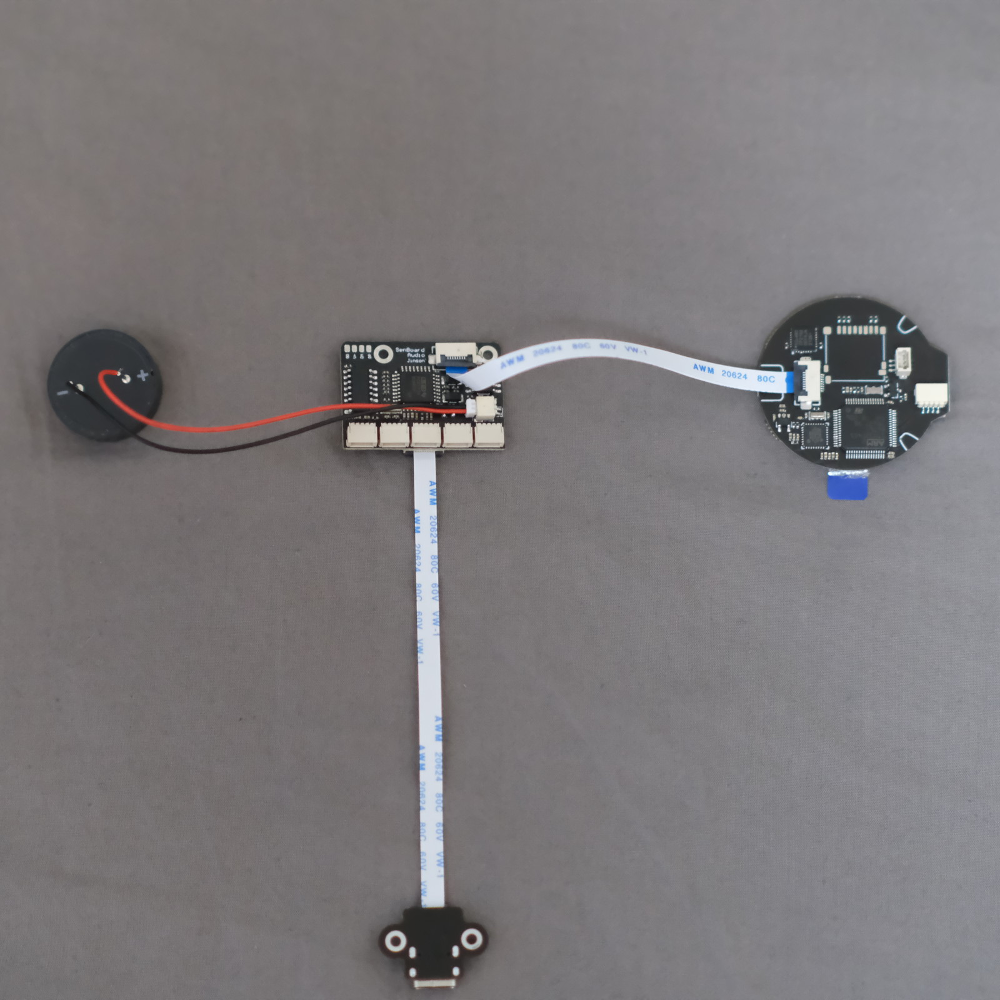
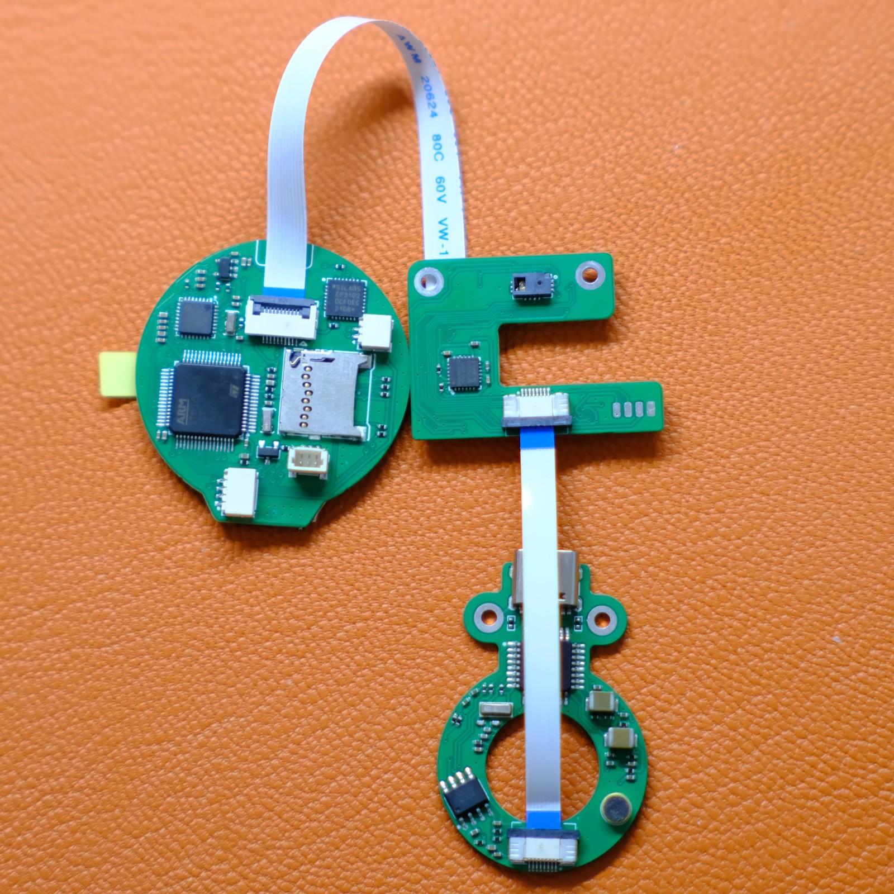
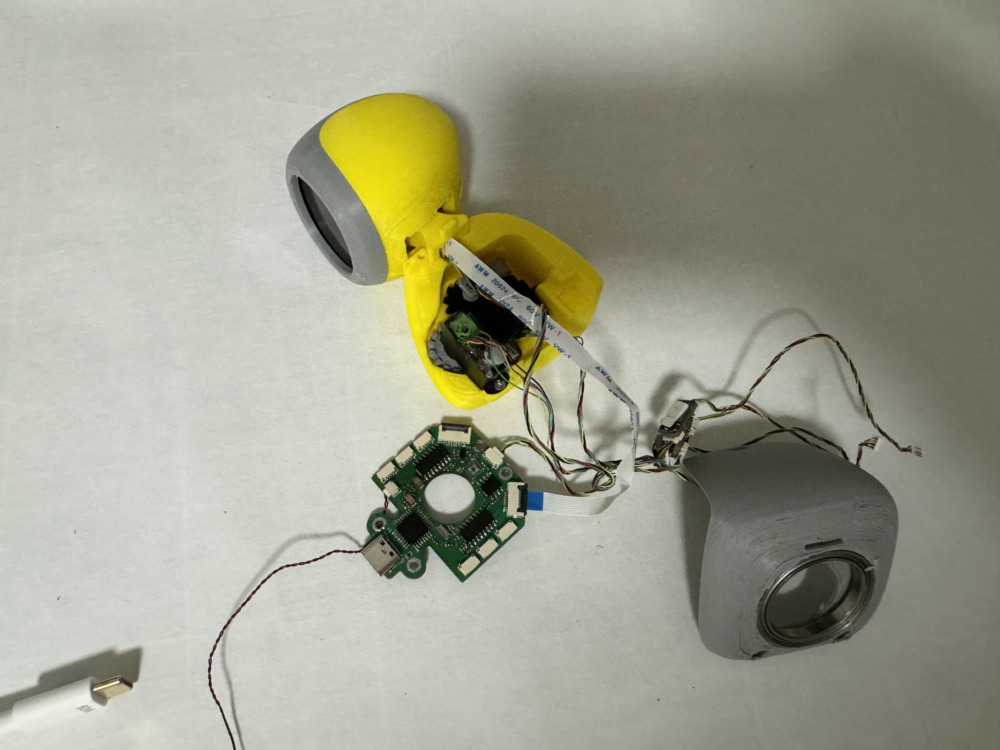
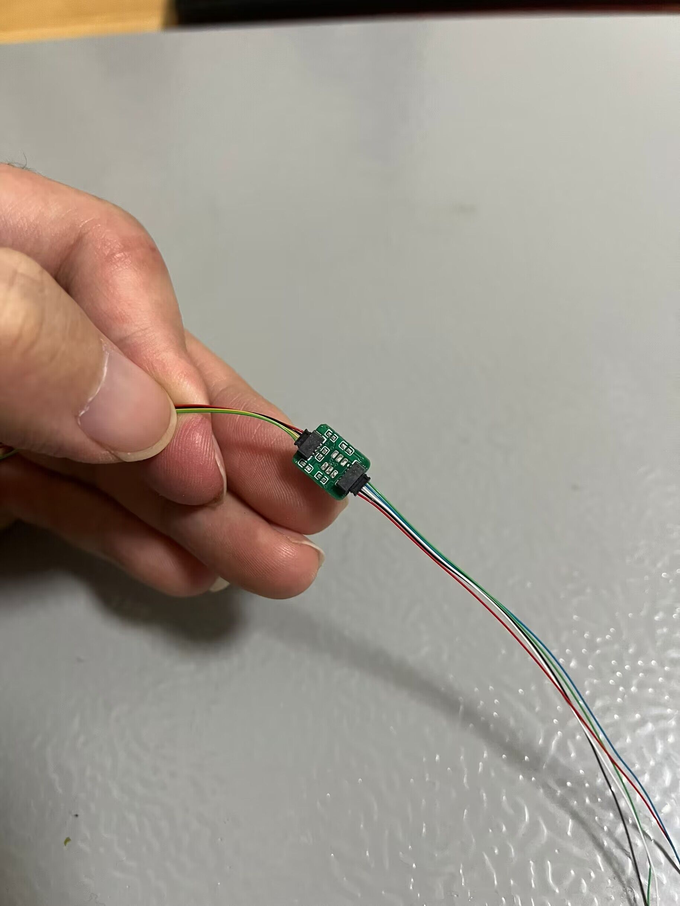

## 5.1 各版本硬件对比
### 稚晖君原版
由于原版不支持语音不推荐复刻，目前劲森的语音板子和稚晖君原版的头部兼容。
### 劲森改进语音版本
此版本对安装要求较高，比较不好安装，推荐复刻小卡版本。

### 小卡改进语音版本
此版本为目前市面上最流行的版本，主要包含三个板子，头部和传感器和语音板子，此板子要搭配使用，不和稚晖君原版兼容。

### 2024年小卡改进版本
此版本将传感器和语音板子合二为一，并且移除了手势传感器，集成了windows hello摄像头，可以实现人脸解锁电脑。

搭配新版本的舵机板子，可以实现舵机的板子的可插拔，减少焊接量。

+ 社区地址：https://github.com/maker-community
+ 电子脑壳地址：https://github.com/maker-community/ElectronBot.DotNet
+ 新版小卡语音板子：https://oshwhub.com/taosi/electronbot-voice 
+ 新版小肥羊舵机板子：https://oshwhub.com/lmy0312/open-source-modified-electronbotservodrive